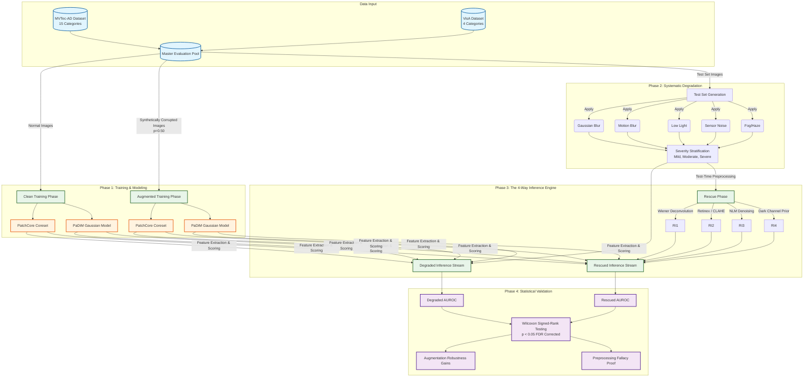

# Experimental Pipeline Architecture

```mermaid
graph TD
    %% Datasets
    subgraph Data Input
        D1[(MVTec-AD Dataset\n15 Categories)]
        D2[(VisA Dataset\n4 Categories)]
        D1 --> MD[(Master Evaluation Pool)]
        D2 --> MD
    end

    %% Training Paradigms
    subgraph Phase 1: Training & Modeling
        MD -->|Normal Images| CT[Clean Training Phase]
        MD -->|Synthetically Corrupted Images\np=0.50| AT[Augmented Training Phase]
        
        CT --> M1[PatchCore Coreset]
        CT --> M2[PaDiM Gaussian Model]
        
        AT --> M3[PatchCore Coreset]
        AT --> M4[PaDiM Gaussian Model]
    end

    %% Corruption & Degradation
    subgraph Phase 2: Systematic Degradation
        MD -->|Test Set Images| TST[Test Set Generation]
        
        TST -->|Apply| C1(Gaussian Blur)
        TST -->|Apply| C2(Motion Blur)
        TST -->|Apply| C3(Low Light)
        TST -->|Apply| C4(Sensor Noise)
        TST -->|Apply| C5(Fog/Haze)
        
        C1 & C2 & C3 & C4 & C5 --> S[Severity Stratification\nMild, Moderate, Severe]
    end

    %% The 4-Way Evaluation
    subgraph Phase 3: The 4-Way Inference Engine
        S --> DI[Degraded Inference Stream]
        
        S --> |Test-Time Preprocessing| R[Rescue Phase]
        R -->|Wiener Deconvolution| RI1
        R -->|Retinex / CLAHE| RI2
        R -->|NLM Denoising| RI3
        R -->|Dark Channel Prior| RI4
        
        RI1 & RI2 & RI3 & RI4 --> RES[Rescued Inference Stream]
        
        M1 & M2 & M3 & M4 --> |Feature Extraction & Scoring| DI
        M1 & M2 & M3 & M4 --> |Feature Extraction & Scoring| RES
    end

    %% Analysis & Stats
    subgraph Phase 4: Statistical Validation
        DI --> EVAL1[Degraded AUROC]
        RES --> EVAL2[Rescued AUROC]
        
        EVAL1 & EVAL2 --> WX[Wilcoxon Signed-Rank Testing\np < 0.05 FDR Corrected]
        WX --> OUT1[Augmentation Robustness Gains]
        WX --> OUT2[Preprocessing Fallacy Proof]
    end
    
    %% Styling
    classDef dataset fill:#e1f5fe,stroke:#01579b,stroke-width:2px;
    classDef model fill:#fff3e0,stroke:#e65100,stroke-width:2px;
    classDef process fill:#e8f5e9,stroke:#1b5e20,stroke-width:2px;
    classDef analysis fill:#f3e5f5,stroke:#4a148c,stroke-width:2px;
    
    class D1,D2,MD dataset;
    class M1,M2,M3,M4 model;
    class CT,AT,DI,RES,R process;
    class EVAL1,EVAL2,WX,OUT1,OUT2 analysis;
```
