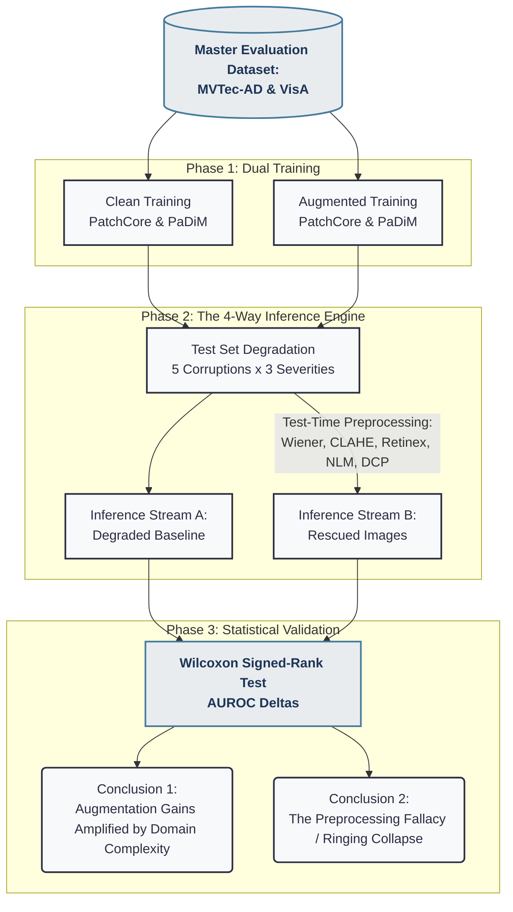

# Experimental Pipeline Architecture

```mermaid
flowchart TD
    %% Dataset
    Data[(Master Evaluation Dataset:\nMVTec-AD & VisA)]

    %% Training Split
    subgraph Phase1 [Phase 1: Dual Training]
        direction LR
        Clean[Clean Training\nPatchCore & PaDiM]
        Aug[Augmented Training\nPatchCore & PaDiM]
    end

    Data --> Clean & Aug

    %% Degradation and Testing
    subgraph Phase2 [Phase 2: The 4-Way Inference Engine]
        direction TB
        Degrade[Test Set Degradation\n5 Corruptions x 3 Severities]
        
        Degrade --> StreamA[Inference Stream A:\nDegraded Baseline]
        Degrade -->|Test-Time Preprocessing:\nWiener, CLAHE, Retinex, NLM, DCP| StreamB[Inference Stream B:\nRescued Images]
    end

    Clean --> Degrade
    Aug --> Degrade

    %% Statistical Analysis
    subgraph Phase3 [Phase 3: Statistical Validation]
        direction TB
        Stats[Wilcoxon Signed-Rank Test\nAUROC Deltas]
        
        Stats --> Find1(Conclusion 1:\nAugmentation Gains Amplified by Domain Complexity)
        Stats --> Find2(Conclusion 2:\nThe Preprocessing Fallacy / Ringing Collapse)
    end

    StreamA --> Stats
    StreamB --> Stats

    %% Styling
    classDef default fill:#f8f9fa,stroke:#2b2d42,stroke-width:2px,color:#2b2d42;
    classDef highlight fill:#e9ecef,stroke:#457b9d,stroke-width:2px,color:#1d3557,font-weight:bold;
    
    class Data,Stats highlight;
```
